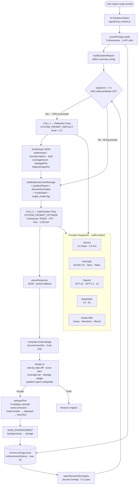

# ★ Prompt Enhancer

> **Transform rough AI prompts into production-quality instructions — directly inside ChatGPT, Claude, Gemini, and more. No backend. No subscription. Your API keys, your data.**

[](.)
[](https://developer.chrome.com/docs/extensions/mv3/)
[](LICENSE)
[](#supported-providers)

---

## The Problem

**Most AI outputs fail to meet expectations on the first attempt** — not because the model is weak, but because the prompt is.

| Pain Point | Real-World Impact |
|---|---|
| Vague, one-line prompts yield generic responses | Users re-prompt 3–5× per task, burning tokens and time |
| No structural framework (role, constraints, output format) | Model cannot determine success criteria → unusable output |
| Context-switching to a separate "prompt tool" | Breaks flow; adds friction to every AI interaction |
| Closed SaaS prompt tools with subscription paywalls | Data sent to third-party servers; no key control; $10–$99/mo cost |

The market offers either expensive SaaS prompt tools (PromptSloth, PromptPerfect) behind subscription paywalls, or static prompt guides that require manual effort every time. Neither solves the problem **in-flow, at the point of use**.

---

## The Solution

Prompt Enhancer is a **Chrome Extension (Manifest V3)** that injects a single ★ button into every major AI chat interface. One click applies a research-backed, 2-call Reflect-then-Refine pipeline that transforms any rough prompt into a structured, production-ready instruction — using the user's own API key, with zero data leaving their browser to a third party.

### Core Value Proposition

| Pillar | What It Means |
|---|---|
| **In-flow** | Enhancement happens inside ChatGPT / Claude / Gemini — no tab switching |
| **Framework-aware** | Auto-selects RISEN (code), RTF (job), TAG (brainstorm), or COSTAR (general) |
| **Research-backed** | Implements Pryzant et al. (arXiv:2601.13922) + LangChain Prompt Optimization algorithms |
| **Privacy-first** | Keys in `chrome.storage.local`; prompts travel directly browser → AI provider |
| **Self-improving** | Personal history drives dynamic few-shot examples that compound with each use |

---

## Architecture



---

## Supported Providers

| Provider | Models | Recommended For |
|---|---|---|
| **Google Gemini** | 2.5 Flash ★, 2.5 Pro, 2.0 Flash, 2.0 Flash Lite | Default — best speed/quality ratio |
| **Anthropic Claude** | Sonnet 4.6 ★, Opus 4.7, Haiku 4.5 | XML-structured output, complex reasoning |
| **OpenAI** | GPT-4o Mini ★, GPT-4o, GPT-4.1, o3, o4-mini | Widest model selection |
| **DeepSeek** | V3 (Chat) ★, R1 (Reasoner) | Cost-efficient; best value per token |
| **Nvidia NIM** | Llama 3.3 70B ★, Nemotron 70B, Mistral Large 2 | Open-weight; no vendor lock-in |

---

## Enhancement Pipeline

### 2-Call Reflect-then-Refine Algorithm

```
handleEnhance(rawPrompt, settings)
│
├─ scorePromptLocally()     → 5 dimension scores          [0 API calls]
├─ loadHistory()            → last 20 accepted pairs      [0 API calls]
├─ selectDynamicExamples()  → 0–2 Jaccard-matched pairs   [0 API calls]
├─ buildGradientReport()    → human-readable deficit log  [0 API calls]
│
├─ IF avgScore < 7.5 AND reflectionMode ON:
│    CALL 1 — Reflection  (temp = 0.2, deterministic)
│    → scratchpad: { weaknesses[], transformations[], draft,
│                    coverageScore, leakageRisk, highestImpactFix }
│
├─ CALL 2 — Optimization
│    user message = rawPrompt + <target_model> + gradientReport
│                 + dynamicExamples + <scratchpad> + <optimization_directives>
│    → { optimizedPrompt, scores, missingInfo, summary, useCase }
│
└─ [On Accept] appendToHistory()  →  feeds future dynamic examples
```

**Cost model**: 1 API call for strong prompts (avg score ≥ 7.5); 2 API calls for typical rough prompts (~70% of real-world usage).

### Prompt Frameworks (Auto-Selected per Use Case)

| Use Case | Framework | Structural Components |
|---|---|---|
| Code / AI-build | **RISEN** | Role · Instructions · Steps · End goal · Narrowing |
| Job applications | **RTF** | Role · Task (XYZ formula) · Format |
| Tech brainstorm | **TAG** | Task · Action · Goal (markdown table output) |
| General / Research | **COSTAR** | Context · Objective · Style · Tone · Audience · Response |

### 5 Essential Elements (Enforced on Every Output)

Before emitting JSON, the optimizer self-checks that every enhanced prompt contains:

1. **ROLE** — Specific expert identity (never "AI" or "assistant")
2. **DIRECTIVE** — Imperative verb + concrete, measurable deliverable
3. **CONTEXT** — Scope, constraints, and *why* each rule matters
4. **FORMAT** — Exact output structure: length, sections, code fences, table columns
5. **SUCCESS** — Verifiable success criteria the user can independently check

### Multi-Signal Diagnosis (arXiv:2601.13922)

The Reflection pass returns four diagnostic signals fed into the Optimization pass as ranked directives:

| Signal | Description |
|---|---|
| `coverageScore` | % of intent dimensions addressed (target ≥ 90) |
| `leakageRisk` | True if draft is a shallow rewrite (Jaccard > 65% AND length growth < 20%) |
| `highestImpactFix` | Single transformation that yields the largest quality gain |
| `interpretabilityNote` | Whether a human can immediately act on the enhanced prompt |

---

## Supported Sites

| Platform | URL Pattern |
|---|---|
| ChatGPT | `chat.openai.com` · `chatgpt.com` |
| Claude | `claude.ai` |
| Gemini | `gemini.google.com` |
| Perplexity | `perplexity.ai` |
| Microsoft Copilot | `copilot.microsoft.com` |
| You.com | `you.com` |

---

## Installation

### Load Unpacked (Developer Mode)

```bash
# 1. Clone the repository
git clone https://github.com/srimon/prompt-enhancer.git

# 2. Open Chrome → chrome://extensions
# 3. Enable Developer mode (top-right toggle)
# 4. Click "Load unpacked" → select the extension/ folder
# 5. Open the popup → add API key → Save & Apply
```

### First Enhancement

1. Open any supported AI site and click inside the chat input
2. A ★ button appears — drag to reposition it anywhere on screen
3. Type your rough prompt, then click ★
4. Review the side-by-side diff, score bars, coverage analysis, and quality report
5. Click **Replace Prompt** to inject the enhanced version, or **Undo** to revert

---

## Feature Overview

| Feature | Detail |
|---|---|
| **2-step analysis** | Reflection call diagnoses weaknesses before optimization; badge shown in modal |
| **Prompt gradients** | 5-dimension local scoring: clarity, specificity, completeness, token efficiency, actionability |
| **Dynamic few-shot** | Jaccard word-overlap + use-case matching selects 0–2 examples from your history |
| **Coverage score** | % of intent dimensions addressed; progress bar in modal |
| **Leakage detection** | Local heuristic: Jaccard > 65% AND length growth < 20% = shallow rewrite warning |
| **Model-specific formatting** | Claude → XML tags; GPT → bold headers; Gemini → markdown H2/H3; DeepSeek → compact |
| **Template shortcuts** | Type `//trigger` in any AI input for instant template insertion |
| **Enhancement history** | Last 20 accepted pairs; browsable in popup with copy and expand controls |
| **Draggable button** | 5px threshold click-vs-drag; position persisted to `chrome.storage.local` |
| **Temperature control** | Per-use-case presets (0.2 code / 0.5 job / 0.9 brainstorm) + manual slider |
| **Reflection toggle** | Disable 2-step mode for single-call speed when quality is already high |

---

## Product Owner

| | |
|---|---|
| **Name** | [Srimon](https://www.linkedin.com/in/srimon) |
| **Role** | Builder · AI Product Architect · Full-Stack Engineer |
| **LinkedIn** | [linkedin.com/in/srimon](https://www.linkedin.com/in/srimon) |

Srimon designed and built Prompt Enhancer end-to-end — translating academic prompt optimization research (Pryzant et al., LangChain) into a production Chrome extension. The project demonstrates applied AI product thinking across the full stack: research-backed pipeline design, zero-backend privacy architecture, multi-provider API dispatch, DOM injection, and a complete popup UI — all shipped without external dependencies.

---

## Technical Stack

| Layer | Technology |
|---|---|
| Extension runtime | Chrome Manifest V3 · Service Worker (`background.js`) |
| Content injection | Vanilla JS content script · CSS isolation via `all: initial` |
| Storage | `chrome.storage.local` (keys, settings, history, button position) |
| AI provider calls | Native `fetch()` — zero SDK dependencies |
| UI | Vanilla JS + hand-authored CSS (popup) · Injected scoped CSS (content) |
| Algorithms | Jaccard similarity · 5-dimension local heuristic scorer · lenient JSON cascade parser |

---

## Privacy

- **API keys** — stored in `chrome.storage.local`; never transmitted to any server other than the chosen AI provider
- **Prompts** — sent directly from browser to AI provider API; the service worker acts only as an internal message relay
- **Enhancement history** — stored in `chrome.storage.local` on your device only; never synced or uploaded
- **No analytics** — zero telemetry, no crash reporting, no usage tracking of any kind

---

## License

MIT © 2026 [Srimon](https://www.linkedin.com/in/srimon)
